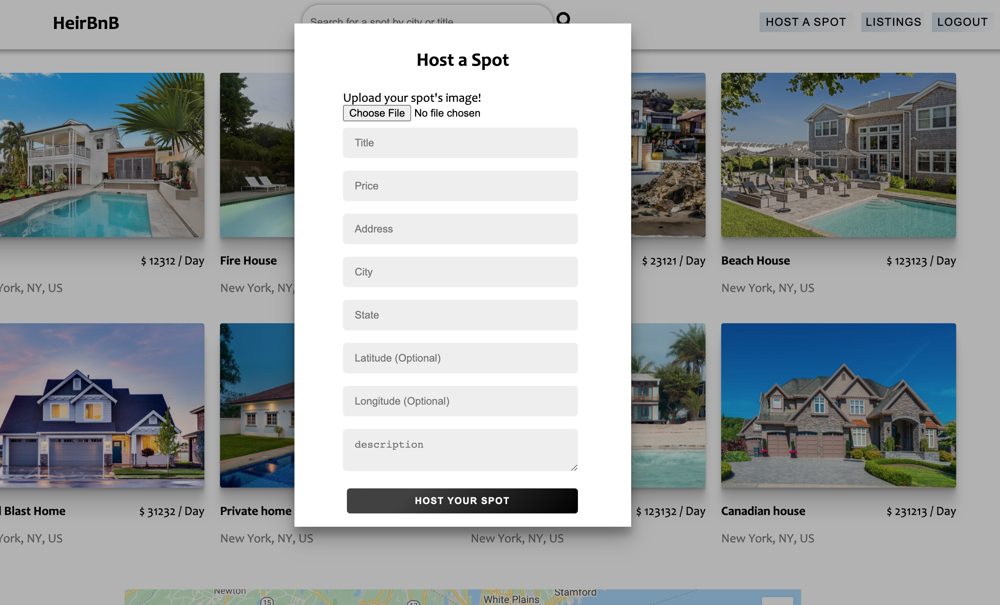
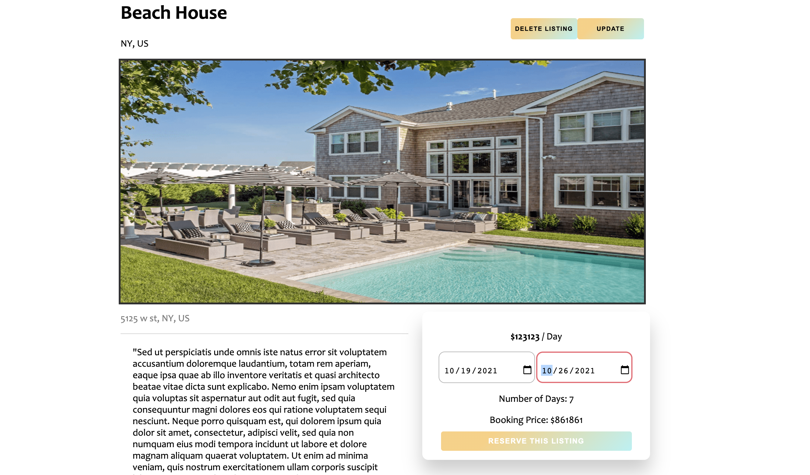

<p align='center'>
  
</p>

# HeirBnB
HeirBnB is a 1 full crud application showcasing AWS and Google Maps integration.
<br></br> 
It is a fullstack React App made with a Redux state manager and a backend using Python, Flask, SQL-Alchemy, and PostgresSQL and many other technologies. 

* View the <a href='https://heribnb.herokuapp.com/'>HeirBnB</a> App Live


## Technologies
* <a href="https://developer.mozilla.org/en-US/docs/Web/JavaScript"></a>
* <a href="https://www.postgresql.org/"></a>
* <a href="https://nodejs.org/"></a>
* <a href="https://reactjs.org/"></a>
* <a href="https://redux.js.org/"></a>
* <a href="https://developer.mozilla.org/en-US/docs/Web/CSS"></a>
* <a href="https://www.python.org/"></a>
* <a href="https://flask.palletsprojects.com/"></a>
* <a href="https://www.heroku.com/home"></a>


## Features


### Feed Page
HeirBnB feed displays all listings that all user have created
Discover and search for new projects through search bar or by scrolling!


### AWS S3 Bucket
Upload an image when either creating a listing or updating an existing one


### Google Maps integration
View where your listing is located via a map either on the feed page or the listing page


### View & Register
View each listing details and register by specifying the dates. Price will be calculated and booking will be confirmed upon registering.

### Splash Page
Welcome to the splash page! Log in or sign up


## Installation
To build/run project locally, please follow these steps:

1. Clone this repository

```shell
git clone https://github.com/Simonvargas/chimera.git
```

2. Install Pipfile dependencies and create the virtual environment
```shell
pipenv install
```

2. Install npm dependencies for the `/react-app`

```shell
cd react-app
npm install
```

3. In the `/` root directory, create a `.env` based on the `.env.example` with proper settings

4. Setup your PostgreSQL user, password and database and ensure it matches your `.env` file

5. Before running any flask commands, confirm you are in the pipenv virtual env. If not, run the command:
```shell
pipenv shell
```

5. In the root folder, create the database by running in the terminal:
```shell
flask db create
```

6. In the root folder, migrate tables to the database by running in the terminal:
```shell
flask db migrate
```

7. In the root folder, seed the database by running in the terminal:
```shell
flask seed all
```

8. Start the flask backend in the `/` root directory
```shell
flask run
```

9. Start the frontend in the `/react-app` directory

```javascript
npm start
```


## Contact

### Simon Vargas
<a href="https://www.linkedin.com/in/simon-vargas-aa0b6a14b/"></a>
<a href="https://angel.co/u/simon-vargas"></a>
<a href="https://github.com/Simonvargas"></a>

simonvargas01@gmail.com


## Special Thanks
* Fellow peers who have given me support and community: [Andrew](https://github.com/andru17urdna),  [Lema](https://github.com/lemlooma), [Nico](https://github.com/nicopierson), [Manna](https://github.com/makon57)

